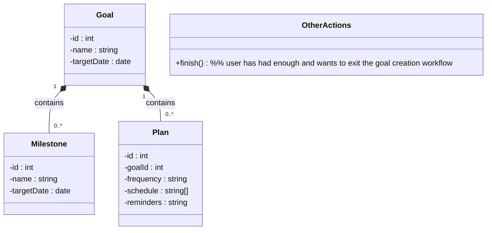

```mermaid

classDiagram
class Goal {
  -id : int 
  -name : string
  -targetDate : date
}

class Milestone {
  -id : int
  -name : string
  -targetDate : date
}

class Plan {
  -id : int
  -goalId : int 
  -frequency : string
  -schedule : string[]
  -reminders : string  
}

Goal "1" *-- "0..*" Milestone : contains
Goal "1" *-- "0..*" Plan : contains

class OtherActions {
    +finish() %% user has had enough and wants to exit the goal creation workflow
}
    
```